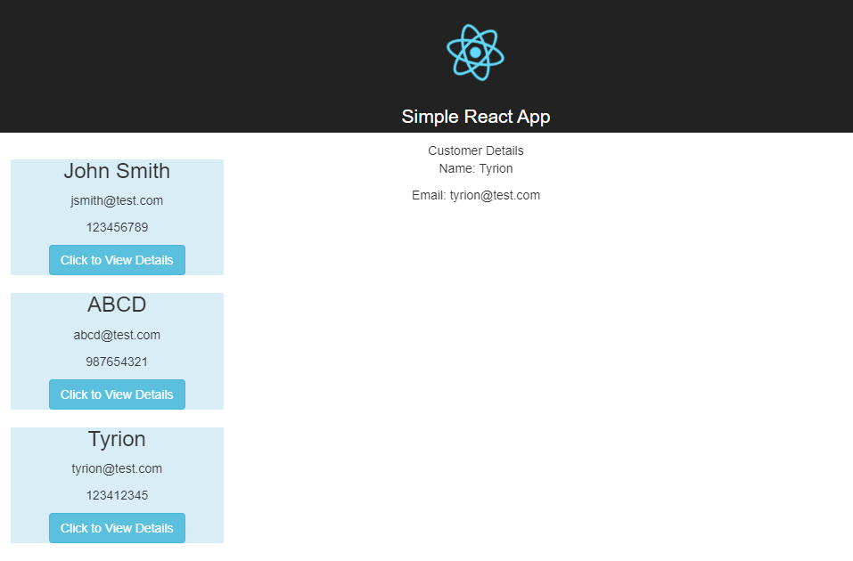

# Simple React JS Project (Dockerized)

## What is the use of this Repo

This project is a fork of the Simple ReactJS Project <https://github.com/aditya-sridhar/simple-reactjs-app>.
The live application can be found at <https://aditya-sridhar.github.io/simple-reactjs-app>.
Its goal is to provide a working simple React app to learn the basics of the technology.

## Prerequisites

1. Install Docker and Docker Compose

## Installation

1. Clone the repository
2. In the terminal, run the command:

```sh
docker-compose up -d --build
```

3. In the browser, visit the URL <http://localhost>
   1. The application runs on **localhost:3000**

You should see :


## Concepts to learn per branch

1. Creating a Component in React
2. Props
3. JSX
4. State
   1. Local state
   2. Global state
5. Flux (Lifecycle)
6. Hooks
7. Router
8. Forms
   1. Form validation
   2. Library
9. Making HTTP calls
10. Communicating between parent and child components
11. Using Bootstrap along with React
12. Using Basic Routing in React
13. Performance and Optimization
14. Tests
    1. Unit tests
    2. End-to-end tests
15. Tools and development environment
    1. Webpack
    2. Babel
    3. ESLint
    4. Prettier
16. Best Practices
    1. Architecture
    2. Naming conventions
    3. Documentation

The project template can be used to build larger projects.

## Live Application URL

This URL has the application deployed:

The application runs on **localhost:3000**

## Application design

#### Components

1. **Customers** Component: This component displays a list of customers. It gets the data from a JSON file in the assets folder.

2. **CustomerDetails** Component: This component displays the details of the selected customer. It also gets its data from a JSON file in the assets folder. This component is the child component of the **Customers** component.

#### HTTP client

The **axios** library is used to make HTTP calls.

#### URL

The application has just one URL, `/customerlist`, which ties to the **Customers** component.

#### Libraries

* axios <https://www.npmjs.com/package/axios>
* react <https://fr.react.dev/>
* react-bootstrap <https://react-bootstrap.netlify.app/>
* react-dom <https://legacy.reactjs.org/docs/react-dom.html>
* react-router-dom <https://reactrouter.com/en/main>
* react-scripts <https://www.npmjs.com/package/react-scripts>
* web-vitals <https://www.npmjs.com/package/web-vitals>

## Resources

**Fork**: <https://github.com/aditya-sridhar/simple-reactjs-app>
**create-react-app**: The following link has all the commands that can be used with create-react-app <https://github.com/facebook/create-react-app>
**ReactJS**: Refer to <https://reactjs.org/> to understand the concepts of ReactJS
**React Bootstrap**: Refer to <https://react-bootstrap.github.io/getting-started/introduction/> to understand how to use React Bootstrap
